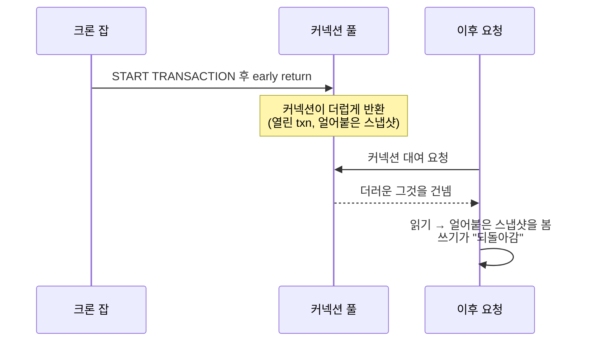

현실을 의심하게 만드는 종류의 버그 리포트였다. 사용자가 값을 수정하면 저장되고,
새로고침하면 — 가끔 옛 값이 돌아와 있다. 같은 요청, 같은 코드, 다른 결과. 그리고
**재시작 20~30분 뒤에만** 시작됐지, 바로는 아니었다.

그 마지막 디테일이 사건의 전부다. *시스템이 워밍업된 뒤에만* 나타나는 버그는 거의
항상 **공유·재사용되는 리소스** 이야기고, 백엔드에서 가장 많이 재사용되는 리소스는
**DB 커넥션 풀**이다.

> **TL;DR** — 수동 트랜잭션 안의 early `return`이 트랜잭션을 연 채로 남겼다.
> 커넥션이 REPEATABLE READ 스냅샷을 쥔 채 **더럽게** 풀로 돌아갔다. 그걸 다음에 빌린
> 요청은 계속 옛 스냅샷을 읽어서 — 쓰기가 "되돌아갔다." 해법은 모든 코드 경로가
> 트랜잭션을 닫게 하는 것, 규율은 트랜잭션 밖으로 분기하지 않는 것.

## 증상을 단서로 읽기

세 사실을 함께 놓으면 원인을 거의 곧장 가리킨다.

- **비결정적** — 동일 요청이 다른 값을 반환.
- **되돌아가는 쓰기** — 업데이트가 성공한 뒤 옛 값이 재등장.
- **재시작 20~30분 뒤에만** — 갓 뜬 프로세스에선 없음.

"비결정적 + 되돌아감 + 워밍업 필요"는 이렇게 읽힌다. *어떤 요청은 옛 상태를 실은
커넥션을 잡는다.* 갓 뜬 풀엔 아직 오염된 커넥션이 없다. 문제 코드가 돌고, 그 커넥션이
다시 대여될 때까지 기다려야 한다.

## 조사 (먼저 후보를 지우기)

failure-mode-first는 이론을 세우기 전에 값싼 용의자부터 제거하는 것이다.

- **DB?** MariaDB 최신, 이상 커넥션 없음, 서버측 이상 없음.
- **캐시?** Redis 없음, TypeORM 쿼리 캐시 꺼짐. 캐싱 아티팩트 아님.

여기서 애플리케이션의 트랜잭션 처리로 좁혀진다. 그리고 로그가 사건을 닫았다.

1. **앱 로그** — *같은 타임스탬프*의 두 요청이 다른 값을 반환. 데이터 레벨이 아니라
   커넥션 레벨 상태라는 결정적 증거.
2. **SQL 로그** — **대응하는 COMMIT/ROLLBACK 없는** `START TRANSACTION`.

## 근본 원인: 트랜잭션 안의 early return

크론 잡이 트랜잭션을 열고, 한 분기에서 — 커밋 전, 롤백 전 — early return 했다.

```javascript
// 버그
await queryRunner.startTransaction();
if (condition) {
  return earlyValue;   // ← 트랜잭션 미종료, 커넥션 미해제
}
await queryRunner.commitTransaction();
```

메서드가 트랜잭션 중간에 반환하면, 커넥션은 **열린 트랜잭션이 붙은 채로** 풀로
돌아간다. MySQL/MariaDB 기본 **REPEATABLE READ**에선, 트랜잭션이 첫 읽기에서 일관된
스냅샷을 잡고 수명 내내 *그* 스냅샷을 제공한다. 그래서 트랜잭션 중간에 멈춘 커넥션은
그걸 다음에 빌리는 누구에게든 세상의 옛 모습을 계속 보여준다.


<span class="figcap">독은 데이터가 아니라 커넥션에 있다. 그걸 빌리는 불운한 요청은 낡고 얼어붙은 뷰를 물려받는다.</span>

이게 모든 증상을 설명한다. 비결정적(어느 커넥션을 뽑느냐에 달림), 되돌아감(얼어붙은
스냅샷이 쓰기보다 앞섬), 워밍업 후에만(크론이 돌고 커넥션이 재대여돼야 함).

## 해법 — 그리고 그 뒤의 규율

**모든** 경로가 트랜잭션을 닫고 커넥션을 해제하게 하라.

```javascript
await queryRunner.startTransaction();
try {
  const result = condition ? await handleA() : await handleB();
  await queryRunner.commitTransaction();
  return result;
} catch (err) {
  await queryRunner.rollbackTransaction();
  throw err;
} finally {
  await queryRunner.release();   // 항상 깨끗한 커넥션을 풀로 반환
}
```

즉각적 해법은 `try/catch/finally`다. 오래가는 해법은 트랜잭션 경계를 손으로 관리하는
걸 아예 그만두는 것이다.

- **트랜잭션 추상화를 써라**(예: `typeorm-transactional` 데코레이터, 또는
  `withTransaction(fn)` 래퍼). 커밋/롤백/해제를 잊을 수 없게.
- **원시 트랜잭션 블록 안에서 분기·early-return 하지 마라.** 꼭 해야 하면 분기를
  먼저 계산하고 트랜잭션은 나중에.
- **어디서나 구조적으로 로깅하라** — 같은 타임스탬프 로그가 커넥션 레벨 분기를
  드러냈기에 잡혔다. 그게 없으면 이 버그는 몇 주씩 숨는다.

## 다른 엔지니어에게 해줄 말

1. **"워밍업 후에만"은 공유·재사용 상태를 뜻한다.** 로직보다 풀과 캐시를 먼저 봐라.
2. **더러운 커넥션은 버그와 무관한 요청까지 오염시킨다.** 누수된 트랜잭션의 폭발
   반경은 풀 전체다.
3. **래퍼가 보장할 수 있는 걸 손으로 관리하지 마라.** RAII식 트랜잭션 헬퍼는 기억해야
   할 규율을 잊을 수 없는 규율로 바꾼다.

---

## 참고자료 & 더 읽을거리

- MySQL — *Consistent Nonlocking Reads*(REPEATABLE READ 스냅샷). [문서](https://dev.mysql.com/doc/refman/8.0/en/innodb-consistent-read.html)
- MariaDB — *SET TRANSACTION ISOLATION LEVEL*. [문서](https://mariadb.com/kb/en/set-transaction/)
- TypeORM — *Transactions & QueryRunner*. [문서](https://typeorm.io/transactions)
- `typeorm-transactional` — 선언적 트랜잭션 경계. [github](https://github.com/Aliheym/typeorm-transactional)
