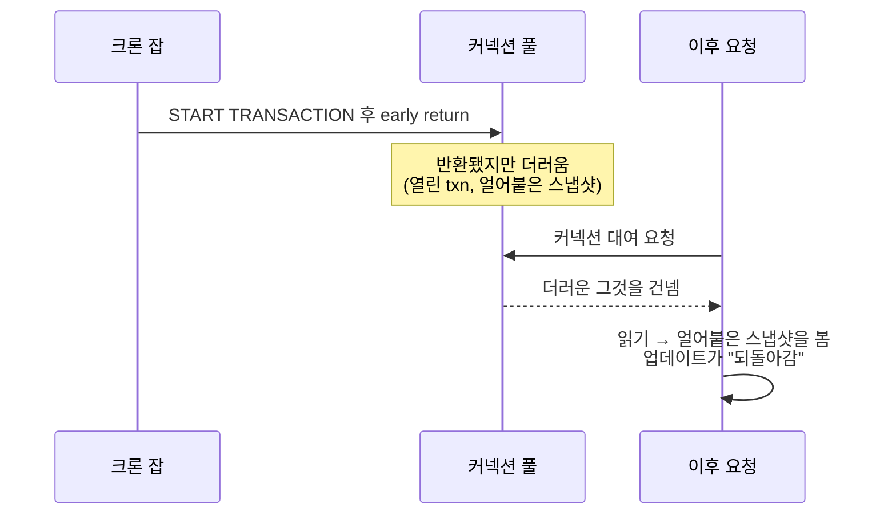

현실을 의심하게 만드는 종류의 버그 리포트였다. 사용자가 값을 수정한다. 저장된다.
새로고침하면 — 가끔 *옛* 값이 돌아와 있다. 같은 요청, 같은 코드, 다른 결과. 그리고
상황을 더 나쁘게 만든 디테일: **서버를 재시작하면 고쳐지는데, 딱 20~30분뿐,** 그
뒤엔 슬금슬금 다시 나타났다.

프로덕션을 오래 디버깅해봤다면 "재시작하면 잠깐 괜찮아짐"에 목덜미가 쭈뼛한다. 이건
네 로직에 있는 버그가 아니라, **시간이 지나며 상태가 쌓이는 공유 리소스**의 시그니처
다. 그리고 백엔드에서 가장 많이 공유되고 재사용되는 리소스는 **DB 커넥션 풀**이다.

## 코드를 건드리기 전에 증상부터 읽기

세 사실을 함께 놓으면 이미 어딘가를 가리킨다.

- **비결정적** — 동일 요청이 다른 값을 반환.
- **되돌아가는 쓰기** — 업데이트가 성공한 뒤 옛 값이 재등장.
- **재시작 20~30분 뒤에만** — 갓 뜬 프로세스에선 없음.

갓 뜬 풀엔 아직 오염된 커넥션이 없다. 문제 코드가 돌고, *그* 커넥션이 다시 대여될
때까지 기다려야 한다. 즉 어떤 요청이 남의 잔여 상태를 실은 커넥션을 뽑고 있다. 이제
사냥할 모양이 생겼다.

## 조사: 값싼 용의자부터 지운다

**용의자 1 — DB.** MariaDB는 최신이고 이 증상과 관련된 알려진 이슈가 없었다. 실제로
누가 붙어 있나 봤더니 앱과 내 DataGrip 세션뿐. 서버측에 수상한 건 없었다. 배제.

**용의자 2 — 캐시.** 앞단에 Redis가 없었고, TypeORM 내장 쿼리 캐시는 꺼져 있었다.
그러니 stale read가 캐싱 아티팩트일 리 없다. 배제.

남은 건 애플리케이션의 트랜잭션 처리. 로그 두 개가 사건을 닫았다.

1. **앱 로그.** 구조적 로깅을 켜자, *같은 타임스탬프*의 두 요청이 다른 값을 반환하는
   걸 잡았다 — 하나는 업데이트를, 하나는 stale를 봤다. 이게 결정적 단서다. 데이터
   레벨이 아니라 **커넥션 레벨** 상태라는 뜻.
2. **SQL 로그.** 이걸 켜자 결정적 증거가 나왔다. **대응하는 COMMIT/ROLLBACK 없는**
   `START TRANSACTION`.

## 근본 원인: 트랜잭션 안의 early return

크론 잡이 트랜잭션을 열고, 한 분기에서 커밋 전에 `return`으로 빠져나갔다.

```javascript
async badCode() {
  const connection = getConnection();
  try {
    await connection.startTransaction();
    // ...비즈니스 로직...
    if (A === true) {
      return A;                       // ← commit/rollback 전에 반환
    }
    await connection.commitTransaction();
    return dto;
  } catch (e) {
    await connection.rollbackTransaction();
  } finally {
    await connection.release();       // 반환은 됨 — 근데 트랜잭션은 아직 열려 있음
  }
}
```

미묘한 지점이 여기다. `finally`가 커넥션을 *반환하긴* 한다. 그래서 "정리된 것처럼"
보인다. 하지만 early `return`이 커밋과 롤백을 둘 다 건너뛰었다 — 그래서 커넥션은
**열린 트랜잭션이 붙은 채로** 풀로 돌아간다. 반환은 됐지만, *더럽다.*

이게 왜 stale read를 만드나: MySQL/MariaDB 기본 **REPEATABLE READ**에선 트랜잭션이
첫 읽기에서 일관된 스냅샷을 잡고 수명 내내 *그* 얼어붙은 스냅샷을 제공한다. 트랜잭션
중간에 멈춘 커넥션은 그걸 다음에 빌리는 누구에게든 세상의 옛 모습을 계속 보여준다.


<span class="figcap">독은 데이터가 아니라 커넥션에 있다. 그걸 빌리는 불운한 요청은 낡고 얼어붙은 DB 뷰를 물려받는다.</span>

이게 모든 증상을 한 번에 설명한다. **비결정적**(어느 커넥션을 뽑느냐), **되돌아감**
(얼어붙은 스냅샷이 쓰기보다 앞섬), **워밍업 후에만**(크론이 돌고 오염된 커넥션이
재대여돼야 함).

## 해법 — 그리고 그 뒤의 규율

**모든** 경로가 커넥션이 반환되기 전에 커밋 또는 롤백하게 하라.

```javascript
async goodCode() {
  const connection = getConnection();
  try {
    await connection.startTransaction();
    const dto = A === true
      ? await handleA(connection)
      : await handleNonA(connection);   // 분기를 try 안에서 계산
    await connection.commitTransaction();
    return dto;
  } catch (e) {
    await connection.rollbackTransaction();
    throw e;
  } finally {
    await connection.release();          // 이제 항상 깨끗한 커넥션
  }
}
```

즉각적 해법은 `try / commit`, `catch / rollback`, `finally / release`. 오래가는
해법은 트랜잭션 경계를 손으로 관리하는 걸 아예 그만두는 것이다.

- **트랜잭션 추상화를 써라** — `typeorm-transactional` 데코레이터나
  `withTransaction(fn)` 래퍼 — 어느 분기에서도 커밋/롤백을 잊을 수 없게.
- **원시 트랜잭션 블록 안에서 분기·early-return 하지 마라.** 분기를 먼저 정하고
  트랜잭션은 나중에.
- **어디서나 구조적으로 로깅하라.** 이 버그는 같은 타임스탬프 로그가 커넥션 레벨
  분기를 드러냈기에 잡혔다. 그게 없으면 몇 주씩 숨는다.

## 내가 얻은 것

1. **"워밍업 후에만"은 공유·재사용 상태를 뜻한다.** 내 로직을 다시 읽기 전에 풀과
   캐시를 봐라.
2. **누수된 트랜잭션의 폭발 반경은 풀 전체다** — 버그와 무관한 요청까지 오염시킨다.
3. **래퍼가 보장할 수 있는 걸 손으로 관리하지 마라.** RAII식 트랜잭션 헬퍼는 *기억
   해야* 하는 규칙을 *잊을 수 없는* 규칙으로 바꾼다.

---

## 참고자료 & 더 읽을거리

- MySQL — *Consistent Nonlocking Reads*(REPEATABLE READ 스냅샷). [문서](https://dev.mysql.com/doc/refman/8.0/en/innodb-consistent-read.html)
- MariaDB — *SET TRANSACTION ISOLATION LEVEL*. [문서](https://mariadb.com/kb/en/set-transaction/)
- TypeORM — *Transactions & QueryRunner*. [문서](https://typeorm.io/transactions)
- `typeorm-transactional` — 선언적 트랜잭션 경계. [github](https://github.com/Aliheym/typeorm-transactional)
