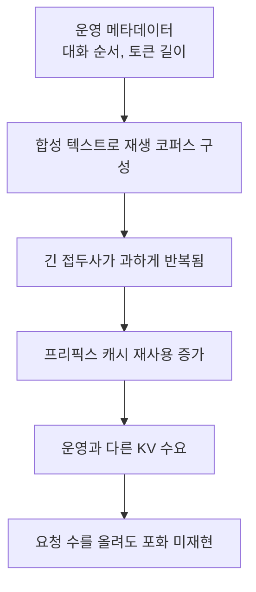

에이전트 제품의 모델을 외부 API에서 사내 서빙으로 옮긴 뒤, "언제 밀리는가"에 답할
근거가 필요했어요. GPU 노드 두 대에 vLLM으로 MoE 계열 모델을 띄우고, 앞에는
로드밸런서와 LLM 프록시를 둔 구성이었습니다. 이미 포화 사고를 한 번 겪었는데
원인까지 확정하지 못한 상태였어요.

처음 계획은 단순했습니다. 부하를 늘려보고 대기가 생기는 지점을 찾으면 될 것 같았어요.
그런데 22시간 동안 부하 시험을 17회차 돌려도 운영에서 봤던 포화가 나오지 않았습니다.
그 결과를 "이 정도 동시성은 괜찮다"로 읽으려던 순간부터 조사가 길어졌어요.

## 재생이라고 불렀지만, 원문이 없었어요

제가 만든 시험대에는 합성 요청도 있었고, 운영 메타데이터를 이용한 재생 요청도
있었습니다. 대화 순서와 토큰 길이 분포를 맞추면 실제 부하에 가까워질 거라고 봤어요.

그런데 당시에는 요청 원문 전체가 없었습니다. 실제 분포와 시스템 접두사를 바탕으로
합성 텍스트를 조합한 코퍼스였어요. 길이가 비슷하다는 것과 모델이 같은 KV 캐시를
필요로 한다는 건 달랐습니다.

특히 세션 안에서 앞 요청의 접두사가 다음 요청에 포함되는 모양을 과하게 재현했어요.
예를 들어 여러 요청이 긴 앞부분을 그대로 공유하고 뒤에 짧은 문장만 붙는 식입니다.
프리픽스 캐시가 이 앞부분을 재사용하면, 요청 수와 토큰 길이는 커 보여도 새로 필요한
KV 블록은 생각보다 적어져요. 시험대가 운영보다 캐시 친화적인 부하를 만들고 있었습니다.

입력 길이와 동시성을 맞추는 것만으로는 캐시가 보게 될 부하까지 맞출 수 없었어요.

다른 트래픽이 섞이는지도 별도로 확인했습니다. 격리한 실행에서는 서버의 성공 카운터
증분과 제가 보낸 요청 수를 대조했어요. 둘이 맞아도 코퍼스의 충실도까지 증명되는 건
아니었습니다. "내 요청만 들어갔나"와 "그 요청이 운영을 닮았나"는 다른 검사였어요.

프록시를 거치지 않는 호출도 조사 중에 발견했습니다. 그건 요청 원장에 구멍이 있다는
근거였지만, 우회 비율만큼 부하가 빠졌기 때문에 포화가 재현되지 않았다고 결론 내릴
수는 없어요. 이 시험대에서 확인한 재현 한계는 원문 부재와 합성 접두사의 과한 재사용이었습니다.

## 시험대의 결과와 운영의 기록을 나눠 봤어요

그래서 한 노드에 남아 있던 vLLM 통계 9만여 샘플과 로드밸런서 접근 로그 2만여 건을
읽었습니다. 이 글은 그때의 조사와 종료 기록을 정리한 것이며, 이번 보완 때 운영 로그를
다시 수집해 측정한 결과는 아닙니다.

처음에는 평균, 최대, 백분위수를 한꺼번에 펼쳐놓았어요. 그런데 서로 다른 추출 범위의
숫자를 한 집단처럼 읽으면 오히려 결론이 흐려집니다. 예전 글에 함께 적었던 KV 최대값과
고사용 구간 수치도 모집단을 명확히 연결할 수 없어, 여기서는 하나의 분포처럼 제시하지
않기로 했어요. 각 자료가 답할 수 있는 질문부터 나눴습니다.

| 자료 | 확인하려던 것 | 여기서 확정할 수 없는 것 |
|---|---|---|
| 격리한 부하 시험 | 같은 조건에서 설정 변경이 지표를 바꾸는가 | 운영의 최대 수용량 |
| 메타데이터 기반 재생 | 대화 순서와 길이 분포를 반영할 수 있는가 | 원문까지 같은 캐시 동작 |
| 운영 스케줄러 통계 | 실행, 대기, KV 사용이 함께 어떻게 움직이는가 | 개별 요청이 느린 전체 원인 |
| 로드밸런서 접근 로그 | 그 경로를 지난 요청의 응답 시간 | 로드밸런서를 우회한 모든 요청 |

## KV가 찼을 때 대기가 늘었어요

운영 로그를 KV 사용률 구간으로 나눠, 각 구간의 샘플 중 대기가 관측된 비율을 봤습니다.
기록에 남은 구간 비교는 이랬어요.

| KV 사용률 구간 | 대기가 관측된 샘플 비율 |
|---|---|
| 0~50% | 3.4% |
| 93% 이상 | 98.4~99.3% |

이건 요청의 실패율이 아니라 주기적으로 찍힌 스케줄러 샘플의 비율입니다. KV가 높은
구간에서는 대기가 거의 항상 보였고, 그때도 실행 시퀀스 슬롯에는 여유가 있었습니다.
그래서 슬롯 수 상향보다 KV 수요를 먼저 봐야 한다고 판단했어요.

GPU 전력과 클럭도 참고했습니다. 하지만 전력이 크게 늘지 않는다는 사실만으로
연산이나 메모리 대역폭 병목을 배제할 수는 없어요. 제가 가진 강한 근거는 KV 사용과
대기의 동반 변화, 그리고 슬롯이 남아 있었다는 관찰입니다. 모든 느린 요청이나 이전
포화 사고의 원인까지 이것 하나로 설명한 건 아닙니다.

관측한 구간에서는 축출(preemption)이 0건이었어요. 진행 중인 요청을 반복해서
다시 계산하는 형태보다, 새 요청이 대기열에 머무는 형태로 저하가 보였습니다.
이를 보고 저는 오류 수만으로 상태를 판단하면 안 되겠다고 생각했어요.
요청이 결국 성공해도 대기 시간이 길면 사용자는 이미 문제를 겪고 있으니까요.

vLLM이 항상 축출 대신 대기만 시킨다는 뜻은 아닙니다. [공식 튜닝 문서](https://docs.vllm.ai/en/latest/configuration/optimization/#preemption)는
KV 공간이 부족하면 요청을 축출하고 나중에 재계산할 수 있다고 설명해요.
제가 적는 건 그 기능 전체가 아니라, 당시 관측한 저하의 형태입니다.

## 후보 9개를 검토했고, 직접 변경 시험은 5개였어요

운영 관찰을 보고 엔진 설정에서 개선할 여지가 있는지 확인했습니다. 우선 기준선을
반복해서 지표가 얼마나 흔들리는지 보고, 처리량과 지연 지표마다 채택 문턱을 정했어요.
처리량이 오르더라도 토큰 사이 지연이나 긴 꼬리의 응답 시간이 나빠지면 함께 봐야 했습니다.

직접 변경하는 회차에서는 기준선과 달라진 인자가 하나인지 스크립트 diff로 확인했어요.
실행 중에 기준 스크립트가 바뀌지 않았는지도 해시로 대조했습니다. 여기서 말하는
반복 측정의 변동 폭은 해당 기준선의 관찰값이지 통계적 신뢰구간은 아니에요.
뒤에 수행한 재생 회차에는 같은 반복 측정이 없어, 그 변동 폭을 확정된 잡음으로
그대로 가져다 쓸 수는 없습니다.

검토한 후보는 9개, 직접 설정을 바꿔 시험한 후보는 5개였습니다. 나머지에는 메모리
예산이나 플랫폼 제약 때문에 시험을 진행하지 않은 선택지도 있어요. 아래 표는
그 검토를 모은 것이고, 모든 행이 성공적으로 기동한 A/B 시험이라는 뜻은 아닙니다.

| 검토한 선택지 | 당시 판단의 근거 |
|---|---|
| `max_num_seqs` 상향 | 대기가 있을 때도 슬롯이 남아 있어 우선순위를 낮춤 |
| `max_num_batched_tokens` 조정 | 키우고 줄인 시험에서 채택할 이득을 확보하지 못함 |
| `max_model_len` 하향 | 요청 길이 상한 변경을 KV 총량 증가와 동일하게 볼 수 없음 |
| `gpu_memory_utilization` 상향 | 당시 남은 GPU 메모리로 추가 예산을 확보하기 어려웠음 |
| expert parallel | KV 개선이 보이지 않았고 토큰 사이 지연은 악화 |
| speculative decoding | 시험에서 처리량이 8.5% 감소 |
| CUDA Graph full | 해당 구성에서 기동 실패 |
| keepalive 중지 | 유휴 시 세션을 내리는 플랫폼 동작 때문에 유지 필요 |
| TP 분할 후 복제본 두 개 | KV 예산 감소와 프리픽스 캐시 분산을 우려해 비권장 |

채택은 0건이었습니다. 처음에는 오랫동안 시험한 결과로 내놓기 민망했어요.
그런데 지금 설정을 바꿀 근거가 없다는 것도 운영 결정이었습니다. 개선을 보여주려고
잡음 수준의 차이를 이득으로 보고 배포할 수는 없으니까요.

그렇다고 "엔진에서 더 개선할 방법은 없다"까지 증명한 것은 아닙니다. 이 모델과
장비, 시험 조건에서 검토한 후보를 채택하지 않았다는 결론이에요. 다음 작업에서는
프롬프트와 출력 길이, 컨텍스트 관리를 통해 요청당 KV 수요를 줄이는 쪽을 우선 보기로
했습니다. 코퍼스부터 운영을 더 닮게 만드는 일도 남아 있었고요.

## 캐시가 0이던 건 캐시를 못 쓰는 모델이라서가 아니었어요

조사 중에 요청별 캐시 적중 토큰이 계속 0으로 보여서 한참 헤맸습니다. 반복되는 긴
시스템 프롬프트가 있는데 왜 재사용이 없을까 싶었어요. 확인해보니 요청별 캐시 통계를
내보내는 플래그가 꺼져 있었습니다. 기록된 0을 실제 미적중으로 읽고 있었던 거예요.

승인을 받고 두 서빙 복제본에 관측 플래그를 순차 적용했습니다. 요청별 캐시 토큰과
처리 시간 분해를 볼 수 있게 했어요. 다만 시간 분해는 확인한 Chat Completions 경로에
한정됩니다. 모든 프로토콜의 전 구간을 추적했다고 쓰면 범위를 넘습니다.

적용하면서 지표 의미가 바뀌는 것도 함께 적었습니다. 당시 Anthropic 호환 응답의 `input_tokens`가
전체 입력에서 캐시 미적중 입력을 나타내는 값으로 바뀌었어요. 그래서 숫자가 크게
줄어 보여도 입력을 줄인 성능 개선이 아니었습니다. 적용 전후를 같은 의미의 시계열로
이어 붙이지 않아야 했어요.

제 계산도 틀린 적이 있습니다. 누적 디코드 시간을 요청 수로 나누어 지연처럼 보고했다가,
동시 실행의 영향이 섞였다는 걸 확인하고 벽시계 기준 계산으로 정정했어요. 카운터의
이름만 보고 나눗셈을 하면 안 된다는 걸, 직접 잘못 보고하고 나서 배웠습니다.

## 남은 질문을 남긴 채로 끝냈어요

이전 포화 사고의 원인도 찾으려 했습니다. 같은 날 프리필, 시퀀스당 KV, 생성 속도가
함께 변했고 그 무렵의 설정 변경과도 맞아 보였어요. 하지만 정확한 변경 시각을 연결하지
못했고, 다른 날의 높은 KV 사용을 그 가설로 설명할 수도 없었습니다. 그래서 사고
원인은 미확정으로 남겼습니다.

이번에 끝낸 건 최대 수용 인원 산출이나 성능 개선 배포가 아니에요. 어떤 부하를
재현하지 못했는지, 어떤 운영 관찰이 KV를 가리키는지, 왜 설정 후보를 채택하지 않았는지를
연결해 남긴 일이었습니다. 요청별 관측을 켠 것도 다음 판단에 필요한 증거를 확보하려는
조치였어요.

가장 오래 남은 건 "내 요청만 들어갔다"와 "운영을 재현했다"의 차이입니다. 실행이
깨끗하고 회차가 많아도, 합성 접두사가 캐시를 너무 잘 타면 다른 시스템을 재고 있는
셈이었어요. 다음에는 동시성 숫자를 먼저 올리기보다, 그 요청들이 어떤 상태를
공유하고 얼마나 오래 메모리를 차지하는지부터 확인할 것 같습니다.

## 참고한 자료

- [Efficient Memory Management for Large Language Model Serving with PagedAttention](https://arxiv.org/abs/2309.06180) (Kwon et al., 2023): KV 캐시 블록 관리
- [Automatic Prefix Caching](https://docs.vllm.ai/en/latest/features/automatic_prefix_caching/) (vLLM): 같은 접두사의 KV 캐시 재사용
- [Optimization and Tuning](https://docs.vllm.ai/en/latest/configuration/optimization/) (vLLM): 축출과 설정의 상호작용. 현재 동작 설명과 당시 관찰을 구분해 읽었어요
- [Metrics](https://docs.vllm.ai/en/latest/design/metrics/) (vLLM): 요청과 스케줄러 지표의 정의
