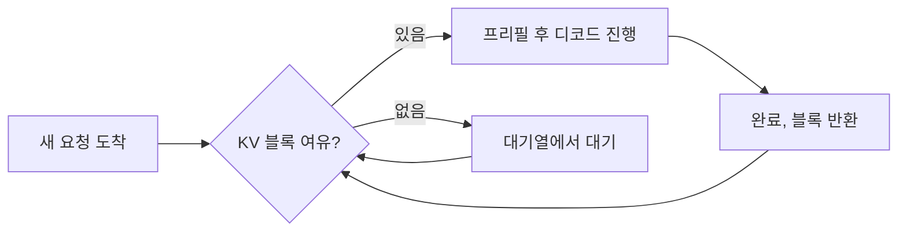

에이전트 제품의 모델을 외부 API에서 사내 서빙으로 옮기고 나서, 두 질문에 답을 못 하는
상태가 됐어요. "언제 터지는가"와 "얼마 쓰는가"였습니다. 한 달 전에 포화 사고가 한 번
있었는데 원인도 확정이 안 된 채였고요. 구성은 GPU 노드 두 대 위에 vLLM으로 MoE 계열
오픈웨이트 모델을 띄우고, 앞에 로드밸런서와 LLM 프록시를 둔 형태였습니다.

그래서 한계를 찾기로 했어요. 부하 시험대를 세우고, 동시성을 올려가며 "이 정도에서
밀린다"는 지점을 찾는 거였죠. 22시간 동안 17회차를 돌렸습니다.

## 아무리 밀어도 안 밀렸어요

결과가 이상했어요. 프로덕션에서 "여기서 밀린다"고 봤던 부하를 시험대에서 재현하면 전부
예상보다 낮게 나왔습니다. 합성 프롬프트라서 그런가 싶어 실데이터 코퍼스로 바꿔봤는데
똑같았어요. 서버는 멀쩡히 받아냈습니다.

이쯤 되면 두 가지 중 하나예요. 서버가 생각보다 튼튼하거나, 우리가 재는 부하가 프로덕션
부하가 아니거나. 되짚어 보니 후자였습니다. 프로덕션 트래픽 안에는 우리가 세지 않던
요청이 섞여 있었어요. 앱의 데이터 에이전트가 내부적으로 부르는 호출, 그리고 프록시를
거치지 않고 엔진에 직접 붙는 경로였습니다. 나중에 세어보니 이 우회 경로가 전체의 30%
정도였어요. 시험대는 나머지 70%만 재현하고 있었던 거죠.

여기서 결론을 "문제 없음"으로 적을 수도 있었어요. 하지만 "문제가 없다"와 "그 상태를 못
만든다"는 다른 문장입니다. 후자를 전자로 적으면 다음 사람이 잘못된 안심 위에서
출발하게 돼요. 그래서 시험대를 접고 방법을 바꿨습니다.

## 만들지 말고 읽기로 했어요

부하를 만들어서 재는 대신, 한 노드가 이미 남겨둔 로그를 읽었어요. vLLM이 주기적으로
찍는 스케줄러 통계 9만여 샘플과 로드밸런서 접근 로그 2만여 건, 대략 2주 반 분량이었습니다.

이걸 분포로 펼치니까 프로덕션의 실제 모양이 처음 보였어요. 분당 요청은 p50이 한 자리,
p99가 20대였고, 동시 실행 중인 시퀀스는 p99가 70대, 2주 최대가 131이었습니다. KV 캐시
사용률은 p99가 72%, 최대 78%였고요. 응답 시간은 p50이 수십 초, p99는 십 분이 넘었어요.
에이전트 워크로드라 프롬프트가 길고 출력도 긴 편이었습니다.

## 병목은 KV 캐시였어요, 슬롯도 연산도 아니고요

vLLM에서 요청이 대기열에 머무는 이유는 크게 셋이에요. 동시 시퀀스 슬롯이 다 찼거나,
KV 캐시 블록이 모자라거나, 연산이 포화됐거나. 셋을 하나씩 실측으로 지웠습니다.

KV 사용률 구간별로 대기 발생률을 나눠보니 답이 거의 나왔어요.

| KV 사용률 구간 | 대기 발생률 |
|---|---|
| 0~50% | 3.4% |
| 93% 이상 | 98.4~99.3% |

동시 실행이 30개 이상인 샘플 3천여 개를 따로 보면 그중 73%가 KV 90% 이상이었는데,
그 순간 시퀀스 슬롯은 1,024개 중 946개가 비어 있었어요. 슬롯 부족이 아니었습니다.
연산도 여유였어요. 동시성이 39에서 190으로 다섯 배 뛰는 동안 GPU 전력은 540W에서
548W로 거의 안 움직였고, SM 클럭도 떨어지지 않았습니다. 남는 건 KV 캐시 하나였어요.

축출은 2주간 0건이었어요. vLLM은 돌던 요청을 쫓아내는 대신 새 요청을 안 받습니다.

여기서 저하의 "형태"를 다시 정의하게 됐어요. 2주간 축출(preemption)이 0건이었거든요.
KV가 꽉 차면 vLLM은 이미 도는 요청을 쫓아내는 게 아니라 새 요청을 대기열에 세웁니다.
그러니까 이 저하는 스래싱이 아니라 입장 차단이에요. 실패로는 안 보이고 대기열만
길어집니다. 에러율 알람은 영원히 안 울리고, 사용자는 "느리다"고만 느껴요. 이 구분이
알림 설계와 이탈 기준을 바꿉니다.

## 엔진 인자 9개를 전부 시험했고, 채택은 0이었어요

병목이 KV라면 엔진 쪽에서 짤 수 있는 게 있는지 봐야죠. 후보를 9개 뽑아서 회차마다
기준선 대비 정확히 하나만 바꾸는 방식으로 돌렸습니다. 스크립트 diff로 바뀐 인자가
하나뿐인지, 원본 스크립트 md5가 런 내내 같은지 매번 확인했어요.

| 후보 | 판정 | 근거 |
|---|---|---|
| `max_num_seqs` 상향 | 무의미 | 실효 1,024, 실측 최대 동시 실행은 131 |
| `max_num_batched_tokens` | 기각 | 두 배와 절반 양방향 시험, 기본값이 최적 |
| `max_model_len` 하향 | 무효 | KV 총량이 여기서 역산되는 구조가 아님 |
| `gpu_memory_utilization` 상향 | 불가 | GPU 여유가 필요량에 못 미침 |
| expert parallel | 기각 | KV 실측 완전 동일, TPOT는 잡음 폭 넘어 악화 |
| speculative decoding | 기각 | 처리량 8.5% 감소 |
| cudagraph full | 기동 실패 | 커널 미지원 |
| keepalive 중지 | 불가 | 저사용 시 플랫폼이 세션을 내림 |
| TP 분할 후 2 replica | 비권장 | 총 KV 43% 감소, 프리픽스 캐시가 쪼개짐 |

채택 0건이에요. 처음엔 이게 실패처럼 느껴졌습니다. 22시간 시험하고 2주치 로그 읽고
나서 "바꿀 게 없다"라니요. 그런데 다시 생각하면 이건 명확한 결론이에요. 엔진에서 짤 게
없다는 건 병목이 엔진 밖에 있다는 근거이고, 남은 지렛대는 "요청당 KV 수요를 줄이는 것"
하나로 좁혀집니다. 그건 앱 축의 일이에요. 프롬프트 길이, 출력 길이, 컨텍스트 관리.
실제로 디코드 구간이 end-to-end의 76%를 차지하고 있어서, 출력 길이 쪽 우선순위를 올리는
근거가 됐습니다.

기각된 가설도 문서에서 빼지 않았어요. "왜 안 했는지"가 없으면 다음 사람이 같은 회차를
다시 돕니다. 실제로 cudagraph 설정은 조사 중에 두 번 시도됐어요. 한 번은 제가, 한 번은
그 기록을 못 본 다른 세션에서요.

## 측정 장비를 의심해야 하는 순간이 있어요

이 조사에서 제일 찝찝했던 숫자가 하나 있었어요. 프리픽스 캐시 적중이 전 요청에서
0이었습니다. 에이전트 워크로드는 시스템 프롬프트가 길고 반복되니까 적중이 0일 리가
없거든요. 모델이나 엔진 한계인가 싶어 한참 봤는데, 원인은 요청별 캐시 통계를 찍는
플래그가 꺼져 있어서였어요. 켜고 나니 실제 적중률은 63%였습니다.

관측 플래그 두 개를 양 노드에 무중단으로 켰는데, 이건 원래 티켓 범위 밖이라 승인을 받고
했어요. 그리고 켜기 전에 한 가지를 먼저 경고했습니다. 이 플래그를 켜면 `input_tokens`의
의미가 "전체 프롬프트"에서 "캐시 미적중분"으로 바뀌어요. 실측으로 6,305에서 161로,
97% 줄어 보입니다. 이 시각 전후를 같은 시계열로 이어 붙이면 안 된다고 명시해뒀어요.
지표 의미가 바뀌는 변경은 변경 자체보다 공지가 중요합니다. 안 알리면 이후 모든
시계열이 조용히 오염되니까요.

제 계산도 하나 틀렸었어요. 누적 디코드 시간을 요청 수로 나눠서 요청당 61.2ms라고
보고했다가, 그게 동시성이 곱해진 값이라는 걸 확인하고 벽시계 델타 기준 24.8ms로
정정했습니다. 이 함정을 런북에 적어뒀어요. 같은 실수를 다음 사람이 반복하지 않게요.

## 확정하지 않은 것

한 달 전 포화 사고의 원인도 이번에 찾으려 했어요. 프리필 토큰이 6.5배, 시퀀스당 KV가
6.7배, 시퀀스당 생성 속도가 7분의 1로 같은 날 동시에 튀는 걸 발견했고, 그날 있었던
설정 변경 세 건과 정합이 맞았습니다.

그런데 확정하지 않았어요. 변경 시각을 정확히 짚지 못했고, 며칠 뒤 KV가 88%까지 올라간
날은 이 가설로 설명이 안 됐거든요. 정황 삼중 일치는 정황이지 확증이 아닙니다. 확증
없이 확정으로 적으면 다음 사람이 추정을 사실로 인용해요. 그래서 "정황이지 확정은
아니다"로 남기고, 어디까지 봤는지를 같이 적어뒀습니다.

## 돌아보면

이번 일의 성과는 성능 수치가 아니에요. 튜닝으로 얻은 개선 폭은 0입니다. 대신 병목이
어디인지, 저하가 어떤 형태인지, 엔진에서 더 볼 게 없다는 것, 그리고 우리 관측이 어디에
구멍이 나 있는지를 알게 됐어요. 이 구분을 뭉개면 과대주장이 됩니다.

"재현이 안 된다"는 실패가 아니라 발견이었어요. 부하가 안 밀린 건 서버가 아니라 부하
정의 때문이었고, 캐시 적중이 0이던 건 모델이 아니라 플래그 때문이었습니다. 측정 장비를
먼저 의심해야 하는 순간이 있다는 걸, 이번엔 22시간 걸려서 배웠어요.

그 다음에 한 일은 엔진 튜닝이 아니라 관측 배관이었습니다. 우회 경로를 프록시로 모으고,
빠져 있던 과금 경로를 복구하고, 요청 상관 키와 본문 트레이싱을 프로덕션에 넣는 일이요.
그건 다음 글에서 다룰게요.

## 참고한 자료

- [Efficient Memory Management for Large Language Model Serving with PagedAttention](https://arxiv.org/abs/2309.06180) (Kwon et al., 2023): vLLM의 KV 캐시 블록 관리와 축출 대신 대기시키는 스케줄링의 근거
- [Automatic Prefix Caching](https://docs.vllm.ai/en/latest/features/automatic_prefix_caching/) (vLLM): 프리픽스 캐시 동작과 적중 통계
- [Optimization and Tuning](https://docs.vllm.ai/en/latest/configuration/optimization/) (vLLM): 이 글에서 시험한 인자들의 공식 설명
- [Metrics](https://docs.vllm.ai/en/latest/design/metrics/) (vLLM): 스케줄러 통계 지표의 정의
